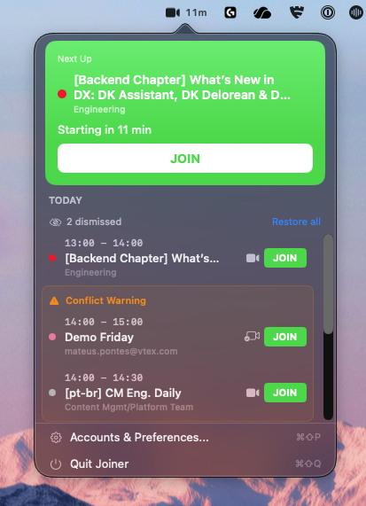

# Joiner


macOS menu bar app that shows your upcoming meetings with one-click join links for Google Meet, Zoom, Microsoft Teams, and Slack Huddle. It reads directly from the macOS Calendar app — no Google account or API keys required.

<p align="center">
  
</p>

⚠️ **Nota:** a versão funcional no momento é a local via `make run`. O DMG ainda não está disponível.

## Features

- Reads from macOS Calendar (supports iCloud, Google, Exchange, CalDAV and any calendar synced to Calendar.app)
- Automatic meeting link detection (Meet, Zoom, Teams, Slack)
- Toggle individual calendars on/off in Preferences
- Conflict grouping for overlapping events
- "Next Up" card for imminent meetings (< 15 min)
- Dynamic countdown in the menu bar (e.g. `12m`)
- Menu bar icon blinks red when a meeting starts
- Notification 5 min before (silent) + at meeting time (with sound)
- "Join Now" action directly from the notification

## Requirements

- macOS 14.0 (Sonoma) or later
- Xcode 15.4+ (for development)
- Calendar access permission (prompted on first launch)

---

## Development Setup

### 1. Clone and install tools

```bash
brew install xcodegen   # already handled by `make setup`
```

### 2. Build and run

```bash
make run    # generates project, builds, and launches
make test   # runs unit tests
```

On first launch the app will request **Calendar access** via the standard macOS permission dialog. Grant access to see your events.

---

## Commands

| Command | Description |
|---------|-------------|
| `make setup` | Install xcodegen via Homebrew |
| `make generate` | Generate Xcode project |
| `make build` | Debug build |
| `make run` | Build and launch the app |
| `make test` | Run unit tests |
| `make clean` | Remove build artifacts |

---

## Contributing

Issues and pull requests are welcome. For larger changes, open an issue first to discuss scope. Please run the test suite before submitting a PR.

---

## License

MIT
